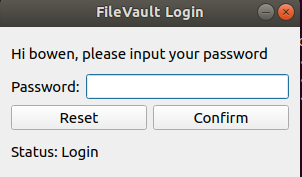
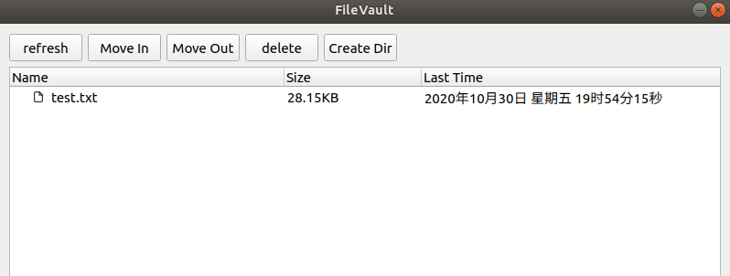

# Linux FileVault
Project for **IS415: 系统软件课程设计**

## Prerequisite
- Linux kernel 4.18
- Qt 5.14.2

## Details
- 保险箱为/home/safebox, /home/safebox/password.dat用于存储所有用户的保险箱密码。
- 内核模块
  - 重载系统调用，屏蔽非保险箱管理程序对保险箱文件夹的访问。
  - 如何区分管理程序与其他程序：保险箱管理程序每次操作都会通过netlink发送其pid(process id)。
- 用户模块
  - 用户身份认证。若用户user已注册，则引导输入密码；若未注册，则设置密码并为其创建一个以其名称命名的保险箱文件夹，如/home/safebox/user，每个用户只能将文件存在自己的文件夹中。
  - 保险箱现有用户id和密码经过base64加密后存储在/home/safebox/password.dat

|重载的系统调用|屏蔽的命令|
|---|---|
|`openat`|`ls`, `vim`, `cat`, `cp`, `touch`|
|`chdir`|`cd`|
|`mkdir`|`mkdir`|
|`symlinkat`|`ln -s`|
|`linkat`|`ln`|
|`rename`|`mv`|

 ## COMMAD
- `ls [dir]`:列出dir目录下的所有文件/文件夹，[dir]为空则列出当前目录下文件/文件夹。
- `cd [dir]`:改变工作目录到dir，[dir]为空则改变到根目录。
- `rm [file/dir]`:删除文件/文件夹。
- `mkdir [dir]`:在当前工作目录下创建文件夹dir。
- `mv [file1] [file2]`:将保险箱内的文件file1移动到保险箱内的新位置file2。
- `mvin [file1] [file2]`:将保险箱外的文件file1移动到保险箱内的新位置file2，file1必须使用绝对路径。
- `mvout [file1] [file2]`:将保险箱内的文件file1移动到保险箱外的新位置file2，file2必须使用绝对路径。
- `chpswd`: 修改保险箱密码。

## GUI

## Useful notes
- `di, si, dx, r10, r8, r9`: [pt_regs structure](https://www.codenong.com/cs106088896/)
- `strace [cmd]`: trace system calls of [cmd].
- `insmod [module].ko`: load the driver.
- `lsmod`: check drivers.
- `rmmod [module]`: unload the driver, [module] can be seen in `lsmod`.
- `du -sh`: check current directory size.
